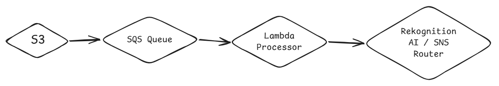
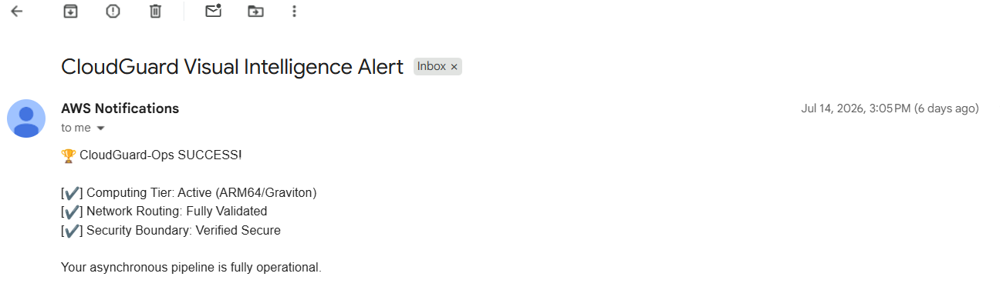

# CloudGuard-Ops 🛰️
### Event-Driven Image Ingestion & Cost-Optimized Security Pipeline

I built a backend infrastructure in the AWS Mumbai (`ap-south-1`) region to process incoming surveillance camera feeds. The goal was to handle sudden traffic spikes without crashing, while dropping background costs to exactly 0 INR when idle.

## 🏗️ System Architecture

## 🛠️ How It Works

* **Amazon S3:** Raw images land here first.
* **Decoupled Events:** Storage drops a simple notification.
* **Amazon SQS:** Buffers massive data spikes safely.
* **Dead Letter Queue:** Isolates broken files instantly.
* **AWS Lambda:** Processes events using ARM64 nodes.
* **Graviton2 Chips:** Saves 20% on compute bills.
* **Long Polling:** Stops expensive idle background checks.
* **Lifecycle Rules:** Wipes files after 48 hours.
* **IAM Roles:** Secures system without hardcoded keys.

## 🚀 Infrastructure Verification Proof

To test the system, I set up a direct validation loop. Every uploaded image forces an end-to-end alert to check overall system health. 

Here is the automated notification hitting my inbox seconds after an S3 upload:

## 💻 Tech Stack

* **Compute:** AWS Lambda & Python 3.12
* **Queuing:** Amazon SQS & DLQ
* **Storage:** Amazon S3
* **AI Core:** Amazon Rekognition
* **Alerting:** Amazon SNS
* **Security:** AWS IAM 
